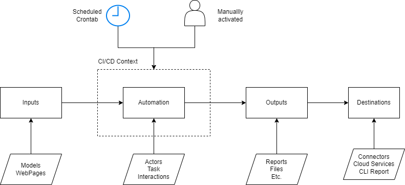

# Proyectos de Automatización / Procesos Habi

## Comandos 

`nx generate @habi/playwright-plugin:generator <automation>`

`nx g @nx/playwright:configuration --project=<automation>`

`nx run playwright-plugin:create-jenkins-job --from=template --name=OK3 --password=11ae5ab68bb06429f8883a76751572a283 --username=admin --url=http://localhost:8080`

## Resumen

Los proyectos de automatización tienen un doble enfoque, dirigido tanto a las pruebas E2E *(end-to-end)* como a la automatización de procesos:

1. **Automatización de Pruebas** 
Garantiza la calidad continua y la fiabilidad de las aplicaciones. Las pruebas automatizadas simulan interacciones del usuario con la UI, proveen un mecanismo de prueba rapido y aseguran que el comportamiento de la aplicación cumpla con las expectativas deseadas.

2. **Automatización de Procesos** 
También se automatizan tareas repetitivas y otros procesos operacionales para agilizar sus flujos de trabajo y mejorar la eficiencia de los diferentes colaboradores.

### ¿Por qué Screenplay y Playwright?

A medida que el panorama digital crece, las estrategias de automatización de ellos deben escalar y evolucionar. Ahí es donde el Patrón Screenplay y Playwright entran en juego:

- **Patrón Screenplay** 
Este patrón aporta claridad y estructura a las pruebas automatizadas. En lugar de los tradicionales Page Objects que pueden volverse pesados y menos mantenibles, 
Screenplay descompone las interacciones del usuario en "Actores", "Tareas", "Preguntas" e "Interacciones". Esto hace que el código sea más legible, escalable y mantenible. 
Como resultado, incluso a medida que sus aplicaciones crecen, las pruebas permanecen modulares y coherentes.

- **Playwright** 
Un marco de pruebas de extremo a extremo moderno, Playwright permite pruebas en navegadores reales, asegurando resultados precisos. Su capacidad para trabajar sin problemas 
con múltiples navegadores, manejar acciones asíncronas y capturar capturas de pantalla/videos lo hace inestimable. 
La API consistente y el robusto conjunto de características ayudan en la creación de pruebas confiables que pueden adaptarse a cambios de la UI.

En esencia, al combinar el enfoque modular de Screenplay con las poderosas capacidades de prueba de Playwright, los proyectos de automatización no solo son ágiles 
sino también a prueba de futuro. Asegura la calidad de las aplicaciones al mismo tiempo que mantiene la facilidad de actualizar pruebas a medida que cambian los requisitos.

## Flujo de Trabajo



## Estructura de Carpetas

Este proyecto sigue una estructura de carpetas específica para garantizar claridad y separación de preocupaciones, especialmente para pruebas de automatización basadas en el Patrón Screenplay utilizando Playwright, SerenityJS y Jenkins.


```bash
.
├── Jenkinsfile
├── README.md
├── package.json
├── playwright.config.ts  # Configuracion general playwright
└── src
    ├── Actors # Usuarios principales realizando acciones
    │   └── user.ts
    ├── Cases  # Agrupacion de los casos de uso
    │   ├── Case
    │   │   ├── test.spec.ts  # Configuraciones especificas playwright
    │   │   └── testCase1.ts
    │   └── README.md
    ├── Interactions # Las interacciones realizadas por un usuario (Click, Scrolls)
    │   ├── FilltheForm.ts
    │   └── ui
    │       └── selectors.ts
    ├── Models  # Modelos de datos
    │   └── data.ts
    ├── Questions # Representa la forma de hacer queries en el sistema
    │   └── question.ts
    ├── Tasks  # Conjunto de tareas realizadas por un usuario 
    │   └── task1.ts
    └── utils
        ├── gcp_connector.ts
        └── rest_connector.ts
```

### Configuracion de Playwright

El archivo `playwright.config.ts` les permite configurar varios ajustes de Playwright para su proyecto.

### Especificacion de Carpetas 

La estructura propuesta busca mantener el objetivo planteado por el patron de diseño screenplay, buscando la manera de mantener lo mas global posible el codigo potencialmente reusable y agrupando los casos de uso particulares en la carpeta `Cases`

- **Actors**: Define 'quién' está realizando la acción. Es esencialmente el usuario o el sistema.
- **Interactions**: Describe las interacciones entre el usuario y el sistema, como hacer clicñ en un botón, Scroll sobre una pagina o llenar un formulario.
- **Models**: Modelos de datos que podrían usarse para los escenarios de prueba.
- **Questions**: Las preguntas permiten al actor consultar el estado del sistema.
- **Tasks**: Representan objetivos o intenciones del usuario de alto nivel que pueden constar de múltiples interacciones.
- **Cases**: Agrupa los diferentes casos de prueba o automatización, puede tener una estructura interna similar a la global cuando sea necesario.


### Funciones de Utilidad (`src/utils`)

En el directorio `utils`, hay funciones de utilidad y conectores que ayudan a establecer conexiones o realizar tareas comunes de utilidad, se plantea definir estas herramientas a traves de interfaces para hacerlas modificable, extensibles y reutilizables.

Por ejemplo:

- **gcp_connector.ts**: Funciones relacionadas con las conexiones de la Plataforma Google Cloud o servicios generales de Google (gmail, spreedsheets etc.)
- **rest_connector.ts**: Funciones de utilidad para realizar llamadas API a servicios externos.


## Contexto CI/CD

Este planificado para ser la infraestructura que soportara los diferentes procesos o automatizaciones, proporcionara los disparadores (triggers) necesarios para ejecutar los procesos, habilitandolos para su uso generalizados.

Se plantea el uso de los siguientes contextos:

### Jenkins (`Jenkinsfile`)

Este archivo es el núcleo de la configuración de Jenkins de ellos. Define los pasos y etapas que tomará su tubería de CI/CD.


### Gitlab CI (`.gitlab-ci.yml`)
